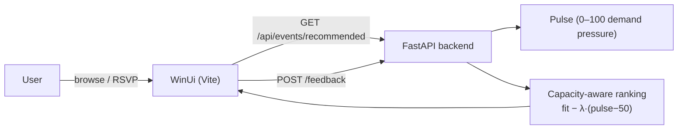

# Flok — _Find Your Flock_

Most social/event apps behave as if attention is unlimited. Real-world social opportunities aren’t: seats are scarce, and “great” hangs (dinners, hikes, study groups, volunteer shifts) are often 6–12 people.

That mismatch creates a familiar loop: the feed keeps showing the same “best” events (because they got early clicks), you keep tapping them, and you keep hitting “Full”. Meanwhile, other good opportunities stay underfilled—so the community wastes capacity and people don’t connect.

Flok is motivated by turning community interest into successful meetups: balance personal fit with scarce capacity so fewer people bounce, more events fill, and more meetups actually happen.

## Problem
- **Hard capacity:** small groups fill quickly.
- **Popularity loops:** the feed keeps resurfacing what already got attention early (rich-get-richer).
- **Dead-ends:** users repeatedly encounter “Full”, which feels like failure and drives churn.
- **Waste:** new/niche events stay underfilled even when they’d be a great match for someone.

In short: most feeds optimize for engagement under the assumption that more eyeballs can always turn into more participation. In the real world, the bottleneck is seats.

## What Flok does
- **Optimizes for participation, not clicks.** The goal is “you joined something you liked,” not “you tapped something popular.”
- **Recommends joinable options.** It ranks by fit × feasibility, and clearly labels why something is blocked (too far, wrong time, full).
- **Routes demand instead of concentrating it.** As an event gets overdemanded, Flok nudges *marginal* users toward strong alternatives—reducing “Full” failures without hiding truly-best matches.
- **Improves long-tail discovery.** Community-created and newer events get a real chance to fill because the system avoids feeding only the early winners.
- **Supports healthier access.** When “fastest finger wins” isn’t the dominant strategy, more people can reliably participate.

The core idea: treat *capacity* as a first-class constraint in ranking, so each recommendation is a plausible “yes” in the real world.

## Diagram (how it stays capacity-aware)


## Quickstart (seed → run → open UI)
1) **Run API**
```bash
cd apps/api
python3 -m venv .venv && source .venv/bin/activate
python -m pip install -r requirements.txt
uvicorn app.main:app --reload --port 8000
```

2) **Seed data**
```bash
curl -X POST http://127.0.0.1:8000/seed \
  -H 'Content-Type: application/json' \
  -d '{"mode":"synthetic","num_users":20,"num_opps":50}'
```

3) **Run UI**
```bash
cd WinUi
npm install
npm run dev
```

4) **Open**
- `http://127.0.0.1:5173`

## Demo Lab (setup → play)
1) Open UI → **Events** → toggle **Demo Lab** ON.
2) Click **Setup demo scenario** (calls `POST /demo/setup`).
3) Click **Spike level 1/2/3** (calls `POST /demo/simulate`) and watch:
   - the “hot” event stays high for the **high-fit** user,
   - but gets pushed down for the **mid-fit** user as demand rises.

## Key endpoints
- `POST /seed` — generate synthetic users + opportunities.
- `GET /api/events/recommended?user_id=...` — ranked list (includes eligibility + reasons).
- `POST /api/events/{event_id}/rsvp` — RSVP.
- `DELETE /api/events/{event_id}/rsvp` — cancel RSVP.
- `POST /feedback` — log `shown|clicked|accepted|declined`.
- `GET /trending?limit=...` — pulse movers.
- `GET /metrics` — utilization / fairness / health.
- `POST /demo/setup` — deterministic demo dataset (two demo users + one hot event).
- `POST /demo/simulate` — spike demand for the hot event (Demo Lab levels).

## Deeper docs
- See `docs/README.md` for the algorithm + implementation notes.
